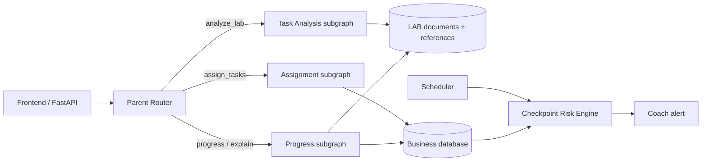
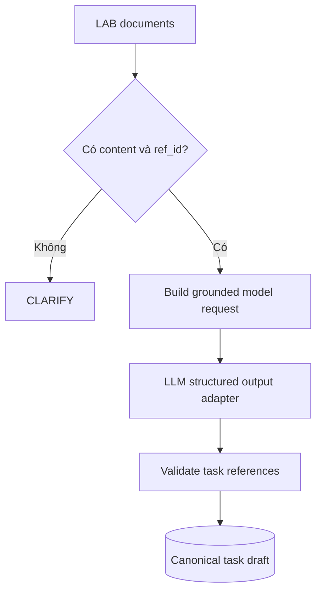
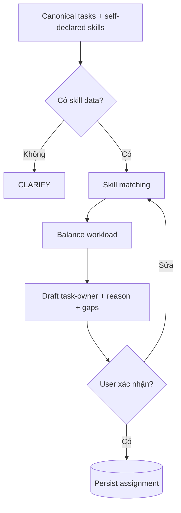
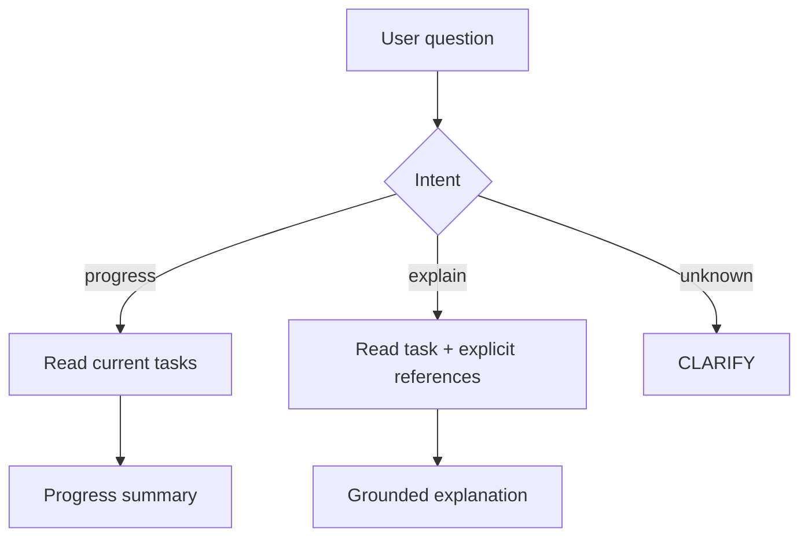
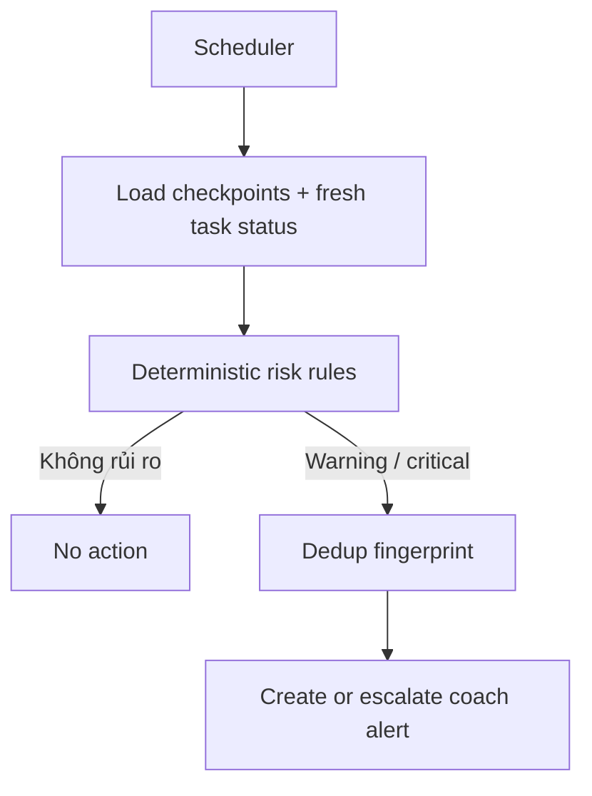
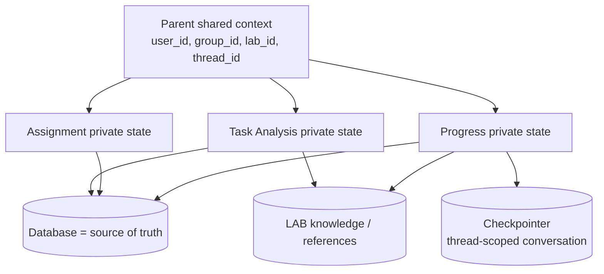

# VLearn LabSpace Backend

Backend **FastAPI + LangGraph** hỗ trợ nhóm học viên biến dữ liệu bài LAB thành task có nguồn tham chiếu, đề xuất phân công theo skill tự khai, theo dõi tiến độ và cảnh báo sớm cho Lab Coach.

## Phạm vi hệ thống

| Capability | Cách xử lý |
|---|---|
| Phân tích bài LAB thành task | AI subgraph, bắt buộc có `reference_ids` |
| Đề xuất task-owner | AI/rule subgraph, dựa trên skill tự khai và workload |
| Giải thích task, hỏi tiến độ | Progress subgraph + conversation memory |
| Cảnh báo trễ checkpoint | Rule engine, không để LLM quyết định |

AI chỉ tạo bản nháp. Người dùng giữ quyền xác nhận assignment, cập nhật task và gửi yêu cầu hỗ trợ.

## Luồng tổng thể



Parent router chỉ chọn workflow. Mỗi subgraph sở hữu prompt, tools, state và test riêng; chúng không chia sẻ toàn bộ working memory.

## Luồng từng subgraph

### Task Analysis



Skeleton hiện dừng ở `awaiting_model`: prompt và request đã sẵn sàng, model provider được nối riêng để không khóa hệ thống vào một hãng AI.

### Assignment



### Progress / Explain



### Coach Alert



Alert là software engineering thuần. LLM có thể tóm tắt alert nhưng không quyết định đội nào bị cảnh báo.

## Memory model



| Dữ liệu | Nơi lưu |
|---|---|
| Task, owner, progress, checkpoint | Database |
| LAB chunks và `ref_id` | Document store/database |
| State trung gian của workflow | Subgraph private state |
| Hội thoại ngắn hạn | LangGraph checkpointer theo `thread_id` |
| Preference đã được user xác nhận | Long-term Store theo `user_id` |

Không dùng conversation memory làm nguồn sự thật về tiến độ. Mỗi lượt bot phải đọc task mới nhất từ database.

## Cấu trúc code

```text
src/
├── agent/
│   ├── router_graph.py          # parent orchestration
│   ├── router_state.py          # shared context contract
│   ├── task_analysis/           # LAB → grounded task draft
│   ├── assignment/              # tasks + skills → owner draft
│   ├── progress/                # progress / task explanation
│   ├── prompts.py               # versionable prompt templates
│   └── tools.py                 # deterministic, testable tools
├── api/                         # FastAPI routes + DI
├── core/                        # config + logging
├── memory/                      # checkpointer + namespaces
└── models/                      # Pydantic API contracts
```

## Tool boundaries

| Tool | Trách nhiệm |
|---|---|
| `search_lab_context` | tìm LAB chunk và giữ `ref_id` |
| `skill_match_score` | so khớp skill tự khai với task |
| `get_task_context` | lấy task cùng đúng reference đã gắn |
| `summarize_team_progress` | tính done/blocked/unassigned |
| `detect_checkpoint_risks` | cảnh báo gần hạn hoặc quá hạn |

Tools không tự thay đổi task, owner hoặc alert. Mutation cần API có authentication, authorization và user confirmation.

## Chạy local

Yêu cầu Python 3.11+.

```bash
python -m venv .venv
# Windows
.venv\Scripts\activate
pip install -r requirements.txt
uvicorn src.api.main:app --reload
```

Swagger UI: `http://127.0.0.1:8000/docs`.

## Chạy nhanh bằng Docker + PostgreSQL

Docker Compose chạy hai service `api` và `db`, tự chờ PostgreSQL healthy, chạy
Alembic migration rồi mới khởi động FastAPI:

```powershell
docker compose up -d --build
docker compose ps
docker compose logs -f api db
```

Các địa chỉ kiểm tra:

- Liveness: `http://127.0.0.1:8000/api/v1/health`
- Readiness có kiểm tra kết nối DB: `http://127.0.0.1:8000/api/v1/ready`
- Swagger: `http://127.0.0.1:8000/docs`

PostgreSQL được expose tại `127.0.0.1:5432`. Dữ liệu nằm trong named volume
`vlearn_labspace_postgres_data`, vì vậy `docker compose down` rồi chạy lại không
làm mất dữ liệu. Không chạy `docker compose down -v` nếu muốn giữ database.

Assignment draft tạo qua `POST /api/v1/assignments/draft` được lưu vào bảng
`assignment_drafts`, gồm request, kết quả, trạng thái và thời điểm tạo.

Mở `psql` trong container:

```powershell
docker compose exec db psql -U vlearn -d vlearn_labspace
```

## Chọn LLM provider

Copy `.env.example` thành `.env`, sau đó chọn provider, model và key:

```env
LLM_PROVIDER=openai
LLM_MODEL=your-model-name
OPENAI_API_KEY=your-key
```

Giá trị `LLM_PROVIDER` hỗ trợ: `openai`, `anthropic`, `gemini`, `nvidia`. Chỉ provider được chọn mới được khởi tạo; xem [cấu hình LLM provider](docs/configuration/llm-providers.md).

Với NVIDIA hosted NIM, có thể dùng file mẫu riêng:

```powershell
Copy-Item .env.nvidia.example .env
# Dán key nvapi-... vào NVIDIA_API_KEY trong .env
python -m src.infrastructure.llm.smoke_test
```

Endpoint mặc định là `https://integrate.api.nvidia.com/v1`; key chỉ tồn tại trong
`codebase/backend/.env` đã được gitignore, không đưa sang frontend.

## Kiểm tra

```bash
python -m ruff check .
python -m pytest -q
python -m eval.scripts.run_eval
```

## API hiện có

| Method | Path | Mục đích |
|---|---|---|
| GET | `/api/v1/health` | health check |
| POST | `/api/v1/assignments/draft` | chạy Assignment subgraph |

Các endpoint Task Analysis, Progress Assistant và Coach Alert đang có skeleton graph/tool nhưng chưa expose ra API.

## Chia việc

| Vùng | Ownership gợi ý |
|---|---|
| `agent/task_analysis`, eval reference | AI/Data member |
| `agent/assignment`, golden set | AI/Evaluation member |
| `agent/progress`, FastAPI routes | Backend member |
| database, scheduler, coach alert | Backend/SE member |
| prompts, acceptance criteria, validation | Product/Research member |

Thay đổi `models/schemas.py` hoặc `router_state.py` là thay đổi contract chung và cần review chéo.

## Tài liệu thêm

- [Architecture overview](docs/architecture/overview.md)
- [Tools and prompts](docs/architecture/tools-and-prompts.md)
- [Data contracts và fixtures](docs/data-model/README.md)
- [Task plan cho 3 người](docs/task-plan-3-people.md)
- [Cấu hình LLM provider](docs/configuration/llm-providers.md)
- [ADR: FastAPI + LangGraph](docs/adr/0001-langgraph-fastapi.md)
