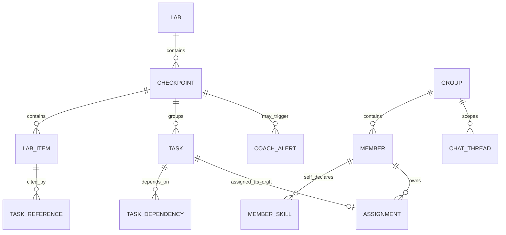

# Data contracts

## Quan hệ dữ liệu



## Dòng dữ liệu

```text
LabManifest
  └─ checkpoint_order
      └─ LabItem.item_order + ref_id
          ↓ Task Analysis
      TaskDraft.task_order + reference_ids
          ↓ Checklist review
      ChecklistDraft
          + GroupSnapshot.skills[self_declared]
          ↓ Assignment
      AssignmentPlan[pending_confirmation]
          ↓ User confirmation
      Active task board
          ↓ Private chat / risk engine
      ChatContext + CoachAlert
```

## Contract và nguồn sự thật

| Contract | File model | Nguồn sự thật |
|---|---|---|
| LAB/checkpoint/item | `src/models/lab.py` | VLearn LAB service |
| Task/checklist draft | `src/models/tasks.py` | Task Analysis + human review |
| Group/member/skill | `src/models/groups.py` | Group service; skill do user tự khai |
| Assignment draft | `src/models/assignments.py` | Assignment subgraph; chờ xác nhận |
| Private chat | `src/models/chat.py` | Message store + checkpointer |
| Coach alert | `src/models/alerts.py` | Deterministic risk engine |

## Quy tắc validation

1. Backend sort LAB theo `(checkpoint_order, item_order)`, không nhờ AI đoán thứ tự.
2. Mỗi task có đúng một `checkpoint_id`, một `task_order` và ít nhất một `reference_id`.
3. `reference_id` phải tồn tại trong đúng `lab_id` và `lab_version`.
4. `depends_on` dùng `task_key` ổn định trong draft; sau persist có thể resolve sang UUID.
5. Assignment draft phải bao phủ mỗi task đúng một lần.
6. `owner_id` phải thuộc group hiện tại.
7. Skill chỉ có `source=self_declared`; AI không tự ghi thêm skill.
8. Chat được scope bằng đồng thời `user_id`, `group_id`, `lab_id`, `thread_id`.
9. Chat summary không phải nguồn sự thật về task status; bot luôn đọc database mới nhất.
10. Alert dùng `fingerprint` để chống gửi trùng.

## Fixtures

Các payload chạy xuyên suốt nằm trong `examples_data/fixtures/`:

- `lab_manifest.json`: LAB có checkpoint, thứ tự và reference.
- `group_snapshot.json`: thành viên và skill tự khai theo phiên.
- `checklist_draft.json`: task graph có dependency và completion criteria.
- `assignment_plan.json`: task-owner draft chờ nhóm xác nhận.
- `private_chat_context.json`: memory của kênh chat riêng.
- `coach_alert.json`: cảnh báo checkpoint có fingerprint.

Fixtures dùng cùng UUID/ref_id để có thể nối trực tiếp trong integration test.
